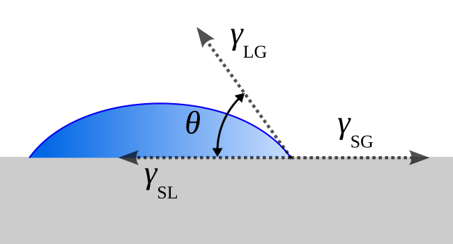

## Introduction

A central goal in nanoparticle synthesis is to control when nucleation occurs and how long it persists, since these factors strongly influence the final particle size distribution. One widely used qualitative framework for thinking about this process is the *LaMer model*.[@LaMer1950] In this picture, the concentration of free monomer in solution first increases (I), then exceeds a supersaturation threshold that triggers a brief burst of nucleation (II). As nuclei form, monomer is depleted, nucleation rapidly shuts off, and subsequent growth proceeds on the existing particles (III).

::: {#fig-lamer-wikimedia}
{fig-align="center" width="512"}

LaMer model for nucleation and growth.  
Image by *Weijie Lai* (CC0), via Wikimedia Commons.
:::

Historically, the nucleation step in the LaMer model was formulated using *classical nucleation theory* (CNT), which provides the thermodynamic barrier and critical size required for a stable nucleus to form. In the sections below, we introduce CNT first.[@Sear2007]

## Units and notation used in this notebook

I will be careful about units because the same symbols can mean "per mole," "per particle," or "per volume" in different sources. The following conventions are used:

- Radius: $r$ in meters (m)
- Surface energy (surface tension): $\gamma$ in J/m$^2$
- Volumetric driving force: $\Delta g_v$ in J/m$^3$
- Free energy of formation of a nucleus: $\Delta G_T(r)$ in Joules (J) per nucleus ($T$ notates 'Total')
- Critical free energy of formation of a nucleus: $\Delta G_c$ in Joules(J) per nucleus ($c$ notates 'critical')

Sign convention:

- $\Delta g_v = g_s - g_l$ is the solid–liquid Gibbs free energy difference per unit volume.
- For nucleation to be thermodynamically favored, the solid must be more stable than the liquid, so
  $$
  \Delta g_v < 0.
  $$

- Supersaturation form (solution nucleation, per particle convention):

  $$
  \Delta \mu = k_B T \ln S
  $$
where $\Delta \mu$ is the chemical potential difference per particle (J/particle) and $S$ is supersaturation ($\frac{c_0}{c_\text{eq}}$).
  
- Converting to a volumetric driving force we use the molecular volume $v_m$ (m$^3$/particle):

  $$
  \Delta g_v = -\frac{\Delta \mu}{v_m} = -\frac{k_B T}{v_m}\ln S.
  $$

## Homogeneous nucleation

Although homogeneous nucleation is much rarer than heterogeneous nucleation, it is conceptually simpler and provides a useful starting point for understanding the more general heterogeneous case.[@Sear2014]

Consider a solid spherical nucleus of radius $r$ forming inside a liquid/solution. Forming the nucleus changes the total Gibbs free energy due to two competing contributions:

1. A *bulk term* proportional to the nucleus volume.
2. A *surface term* proportional to the new interfacial area.

The volume of a sphere is
$$
V = \frac{4}{3}\pi r^3.
$$

Let $g_s$ and $g_l$ denote the Gibbs free energy per unit volume of solid and liquid, respectively (J/m$^3$). The *bulk (volume)* contribution is

$$
\Delta G_V(r) = \frac{4}{3}\pi r^3 (g_s - g_l)
= \frac{4}{3}\pi r^3 \Delta g_v.
$$

This, however, doesn't tell the whole story; creating a surface requires energy. If $\gamma$ is the solid–liquid interfacial energy (J/m$^2$), (also referred to as surface tension) then the *surface* contribution is

$$
\Delta G_{\text{s}}(r) = 4\pi r^2 \gamma.
$$

This value is never negative as it always takes energy to create an interface.

Now, the total free energy of forming a nucleus can be described as

$$
\begin{align*}
    \Delta G_T(r) &= \Delta G_V(r) + \Delta G_S(r) \\
    &= \frac{4}{3}\pi r^3 \Delta g_v + 4\pi r^2 \gamma.
\end{align*}
$$

For small $r$, the surface term dominates and $\Delta G(r)$ increases with size. For sufficiently large $r$, the bulk term dominates and $\Delta G(r)$ decreases with size. This competition produces a maximum in $\Delta G(r)$, which is the *nucleation barrier*, shown in @fig-bulk-surface.

```{python}
#| label: fig-bulk-surface
#| fig-cap: "Free energy of formation contributions of the bulk and surface terms"
import numpy as np
import matplotlib.pyplot as plt
from IPython.display import SVG

def delta_g_terms(r_m, delta_gv, gamma):
    dg_bulk = (4/3) * np.pi * r_m**3 * delta_gv
    dg_surf = 4 * np.pi * r_m**2 * gamma
    return dg_bulk, dg_surf, dg_bulk + dg_surf

def r_c(delta_gv, gamma):
    return 2 * gamma / np.abs(delta_gv)

def dg_c(delta_gv, gamma):
    return (16 * np.pi * gamma**3) / (3 * delta_gv**2)

# arbitrary values
delta_gv = -1.15e8  # J/m^3
gamma = 0.5         # J/m^2

# fixed window based on this case
rc_ref = r_c(delta_gv, gamma)
dgc_ref = dg_c(delta_gv, gamma)

x_max_nm = 2.0 * rc_ref * 1e9
y_min = -1.0 * dgc_ref
y_max = 1.5 * dgc_ref

r_m = np.linspace(0.0, x_max_nm * 1e-9, 1000)
dg_bulk, dg_surf, dg_tot = delta_g_terms(r_m, delta_gv, gamma)

rc_nm = r_c(delta_gv, gamma) * 1e9
dgc = dg_c(delta_gv, gamma)

fig, ax = plt.subplots(figsize=(7, 5))

ax.plot(r_m * 1e9, dg_tot, lw=2, label="Total")
ax.plot(r_m * 1e9, dg_bulk, "--", lw=2, color="g", label="Bulk")
ax.plot(r_m * 1e9, dg_surf, "--", lw=2, color="r", label="Surface")

ax.scatter([rc_nm], [dgc], s=60, zorder=3, color='k')
ax.annotate(
    r"$(r_c, \Delta G_c)$",
    xy=(rc_nm, dgc),
    xytext=(rc_nm * 1.10, dgc * 1.20),
    arrowprops=dict(arrowstyle="->"),
)

ax.set_xlim(0, x_max_nm)
ax.set_ylim(y_min, y_max)

ax.spines["bottom"].set_position("zero")
ax.spines["right"].set_visible(False)
ax.spines["top"].set_visible(False)

ax.set_xlabel("Radius (nm)")
ax.set_ylabel(r"$\Delta G$ (J per nucleus)")
ax.legend(frameon=False)

fig.tight_layout()
plt.savefig("bulk_surface_contributions.svg")
plt.close(fig)

SVG(filename="bulk_surface_contributions.svg")
```

## Critical radius $r_c$ and barrier height $\Delta G_c$

The *critical radius* $r_c$ is defined by the maximum of $\Delta G(r)$:
$$
\left.\frac{\partial\Delta G_T}{\partial r}\right|_{r=r_c} = 0.
$$

Differentiate:
$$
\frac{\partial\Delta G_T}{\partial r}
= 4\pi r^2 \Delta g_v + 8\pi r \gamma.
$$

Set equal to zero and solve for $r$ <!-- \neq 0$ -->:
$$
\begin{align*}
    4\pi r_c^2 \Delta g_v + 8\pi r_c \gamma &= 0 \\
    \Rightarrow r_c &= \frac{2\gamma}{\lvert\Delta g_v\rvert}.
\end{align*}
$$

Clusters smaller than $r_c$ tend to shrink because doing so lowers the free energy. Clusters larger than $r_c$ tend to grow, since further growth reduces the free energy, even though $\Delta G(r)$ may still be positive. 

The critical radius is of particular importance because it determines the kinetic limitation of nucleation: only clusters that grow large enough to surpass the free energy barrier at $r_c$ are likely to continue growing.

The maximum free energy (the barrier) is $\Delta G_c = \Delta G_T(r_c)$,

$$
\Delta G_c = \frac{16\pi\gamma^3}{3(\Delta g_v)^2}.
$$

## Methods for reducing the critical radius

### Supercooling  and superheating

Near the fusion temperature $T_f$, the bulk driving force can be approximated as linear:

$$
\Delta g_v = \Delta h_v - T \Delta s_v
$$

At $T = T_f$,

$$
\Delta g_{f, v} = 0
\\
\Rightarrow \Delta h_{f, v} = T_f \Delta s_{f, v}
$$

By approximating $\Delta h_v \approx \Delta h_{f,v}$ and $\Delta s_v \approx \Delta s_{f,v}$, we get

$$
\begin{align*}
    \Delta g_v &\approx  \Delta h_{f, v} - T\Delta s_{f,v} \\[1em]
    &= \Delta h_{f,v} - \frac{T\Delta h_{f,v}}{T_f} \\[1em]
    &= \Delta h_{f,v} \frac{T_f - T}{T_f}
\end{align*}
$$

So,

$$
\Delta g_v = \frac{\Delta h_f}{T_f}\Delta T,
$$

where $\Delta h_f$ is the enthalpy of fusion per unit volume (J/m$^3$) and $\Delta T = T - T_f$ (negative below $T_f$). This approximation is valid for $\lvert\Delta T\rvert \ll T_f$.

Substituting into the critical radius gives:

$$
r_c = \frac{2\gamma T_f}{\Delta h_{f,v}}\frac{1}{\Delta T}
$$

and

$$
\Delta G_c = \frac{16 \pi \gamma^3 T_f^2}{3 (\Delta h_{f,v})^2} \frac{1}{(\Delta T)^2}
$$

We notice that $r_c$ and $\Delta G_c$ diminish with increasing supercooling. A similar mathematical derivation for superheating can be done.

### Supersaturation (nucleation from solution)

For nucleation from solution we express the chemical potential driving force in terms of supersaturation, defined here as $S = \frac{c_0}{c_\text{eq}}$,

$$
\Delta \mu = k_B T \ln S \quad \text{(per particle)}.
$$

Converting to a volumetric driving force using the molecular volume $v_m$:

$$
\Delta g_v = -\frac{\Delta \mu}{v_m} = -\frac{k_B T}{v_m}\ln S.
$$

Substituting into the critical radius gives:

$$
r_c = \frac{2\gamma v_m}{k_B T \ln S}.
$$

and in terms of molar volume, $V_M$,

$$
\Delta G_c = \frac{16 \pi \gamma^3 V_M^2}{3(RT\ln(S))^2}
$$

This highlights three experimentally relevant parameters that affect nucleation:

- surface/interfacial energy $\gamma$ (tuned by choice of solvent and ligand)
- temperature $T$
- supersaturation $S$

## Nucleation rate and the free energy barrier

Thermodynamics tells us the shape of $\Delta G$, but not how quickly nuclei appear. CNT models the *nucleation rate* $J$ (nuclei formed per unit volume per unit time) as being suppressed exponentially by the free energy barrier:

$$
J = J_0 \exp\!\left(-\frac{\Delta G_c}{k_B T}\right),
$$

where $k_B$ is Boltzmann’s constant and $J_0$ is a kinetic prefactor$^*$. Using the CNT barrier height,

$$
\Delta G_c = \frac{16\pi\gamma^3}{3(\Delta g_v)^2},
$$

we obtain

$$
J = J_0 \exp\!\left(
-\frac{16\pi\gamma^3}{3(\Delta g_v)^2 k_B T}
\right).
$$

For solution nucleation we may substitute

$$
\Delta g_v = -\frac{k_B T}{v_m}\ln S,
$$

which gives

$$
J = J_0 \exp\!\left(
-\frac{16\pi\gamma^3 v_m^2}{3 k_B^3 T^3 (\ln S)^2}
\right).
$$

Because $J$ depends exponentially on the barrier, small changes in $\gamma\,$, $T$, or $S$ can change the nucleation rate by many orders of magnitude, as showcased in @fig-sensitivity. This sensitivity is one of the reasons nanoparticle synthesis can produce either no particles or a sudden burst of nuclei depending on experimental conditions.

---
<p style="font-size:0.8em">
$^* J_0$ is the product of the number of nucleation sites, $N_S$, the rate at which molecules attach to the nucleus $j$, and the Zeldovich factor $Z$ which gives the probability that a nucleus at the top of the energy barrier to form a new phase rather than dissolve.
</p>

```{python}
#| label: fig-sensitivity
#| fig-cap: "Effect of the different parameters on the free energy"
import numpy as np
import matplotlib.pyplot as plt
from matplotlib.patches import Patch
from IPython.display import SVG

# constants & reference values
k_B = 1.380649e-23
v_m = 1.696e-29
gamma_ref = 0.1
T_ref = 573.0
S_ref = 100.0

# styling
facecolor_controllable = "lightgreen"
facecolor_sensitive = "salmon"
alpha = 0.6
J_MIN, J_MAX = 1e-40, 10

def j_rel(S, T, gamma):
    lnS = np.log(S)
    expo = 16 * np.pi * gamma**3 * v_m**2 / (3 * k_B**3 * T**3 * lnS**2)
    return np.exp(-expo)

# figure
fig, axs = plt.subplots(1, 3, figsize=(8.0, 4), sharey=True)

# shared y-axis
for ax in axs:
    ax.set_yscale("log")
    ax.set_ylim(J_MIN, J_MAX)

# J vs S
S = np.logspace(0.01, 3, 600)
axs[0].plot(S, j_rel(S, T_ref, gamma_ref), lw=2)
axs[0].set_xscale("log")
axs[0].axvspan(1.2, 20, color=facecolor_sensitive, alpha=alpha)
axs[0].axvspan(20, 1100, color=facecolor_controllable, alpha=alpha)
axs[0].set(
    xlabel="$S$",
    ylabel="$J/J_0$",
    title="$J$ vs $S$\n($T$ = 573 K, $\\gamma$ = 0.1)",
)

# J vs T
T = np.linspace(100, 400, 600)
axs[1].plot(T, j_rel(S_ref, T, gamma_ref), lw=2)
axs[1].axvspan(95, 250, color=facecolor_sensitive, alpha=alpha)
axs[1].axvspan(250, 405, color=facecolor_controllable, alpha=alpha)
axs[1].set(
    xlabel="$T$ (K)",
    title="$J$ vs $T$\n($S$ = 100, $\\gamma$ = 0.1)",
)

# J vs gamma
g = np.logspace(-3, 0, 600)
axs[2].plot(g, j_rel(S_ref, T_ref, g), lw=2)
axs[2].set_xscale("log")
axs[2].axvspan(0.1, 0.7, color=facecolor_sensitive, alpha=alpha)
axs[2].axvspan(0.0009, 0.1, color=facecolor_controllable, alpha=alpha)
axs[2].set(
    xlabel="$\\gamma$ (J/m$^2$)",
    title="$J$ vs $\\gamma$\n($S$ = 100, $T$ = 573 K)",
)

# legend for the shaded regions
legend_handles = [
    Patch(facecolor=facecolor_controllable, alpha=alpha, label="more controllable"),
    Patch(facecolor=facecolor_sensitive, alpha=alpha, label="high sensitivity"),
]
fig.legend(
    handles=legend_handles,
    loc="lower center",
    ncol=2,
    frameon=False,
    
)

fig.tight_layout(rect=[0, 0.08, 1, 1])
plt.savefig("delta_g_sensitivity.svg")
plt.close(fig)

SVG(filename="delta_g_sensitivity.svg")
```

## Heterogeneous nucleation

In many real syntheses, nucleation occurs on container walls, impurities, seeds, or other surfaces (i.e., heterogenously).

::: {#fig-contact-angle fig-cap="Schematic of a liquid drop showing the quantities in the Young equation. Image adapted from *Joris Gillis~commonswiki* (CC0), via Wikimedia Commons."}

:::

The contact angle, $\theta$, is the angle formed where a liquid meets a solid surface. More precisely, it’s measured between the tangent to the liquid–vapor interface and the tangent to the solid–liquid interface at the point where they intersect. This angle is used to describe how well a liquid wets a solid surface and is related to the interfacial tensions through the Young equation, which describes mechanical equilibrium at the three-phase contact line.

$$
\gamma_\text{SG} = \gamma_\text{SL} + \gamma_\text{LG} \cos(\theta)
$$

In heterogeneous nucleation, the barrier height is reduced relative to homogeneous nucleation by a geometric factor $f(\theta)$ that depends on the contact angle $\theta$:

$$
\Delta G_{c,\text{hetero}} = f(\theta)\,\Delta G_{c,\text{homo}}
$$
where
$$
0 \le f(\theta) \le 1, \qquad 0\degree \le \theta \le 180\degree
$$


This reduction can strongly increase the nucleation rate, because the rate depends exponentially on the barrier.

```{python}
#| eval: false
import numpy as np
import matplotlib.pyplot as plt
from matplotlib.animation import FuncAnimation
from IPython.display import Video

# parameters
G_s = 0.0
G_l = 1.15e8
gamma = 0.5
delta_Gv = G_s - G_l  # negative

# radius grid & precomputed terms that don't depend on theta
r = np.linspace(0, 20e-9, 1000)
r_nm = r * 1e9
delta_G_bulk = (4/3) * np.pi * r**3 * delta_Gv
delta_G_surface = 4 * np.pi * r**2 * gamma
delta_G_homo = delta_G_bulk + delta_G_surface

r_c = -2 * gamma / delta_Gv
delta_G_homo_c = (16 * np.pi * gamma**3) / (3 * delta_Gv**2)

# figure
fig, ax = plt.subplots(figsize=(7, 5))

(line_homo,) = ax.plot(r_nm, delta_G_homo, lw=2, color="k", label="Homo")
(line_hetero,) = ax.plot(r_nm, delta_G_homo, lw=2, color="C0", label="Hetero")

pt_homo = ax.scatter([r_c * 1e9], [delta_G_homo_c], color="k", zorder=3, s=50)
pt_hetero = ax.scatter([r_c * 1e9], [delta_G_homo_c], color="C0", zorder=3, s=50)

txt = ax.text(0.02, 0.92, "", transform=ax.transAxes)

ax.spines["bottom"].set_position("zero")
ax.spines["right"].set_visible(False)
ax.spines["top"].set_visible(False)

ax.set_xlabel("Radius (nm)")
ax.set_ylabel(r"$\Delta G$ (J)")
ax.set_xlim(0, 1.8 * r_c * 1e9)
ax.set_ylim(0.015 * delta_G_bulk.min(), 0.08 * delta_G_surface.max())
ax.legend(frameon=False)
fig.tight_layout()

# to get a loop, we iterate theta from 0 to 180 then back to 0.
thetas = np.concatenate([
    np.linspace(0, 180, 181),
    np.linspace(180, 0, 181)[1:]
])

def f_theta(theta_deg):
    th = np.deg2rad(theta_deg)
    return 0.25 * (2 + np.cos(th)) * (1 - np.cos(th))**2

def update(i):
    theta = float(thetas[i])
    f = f_theta(theta)

    y_hetero = f * delta_G_homo
    line_hetero.set_ydata(y_hetero)

    delta_G_hetero_c = f * delta_G_homo_c
    pt_hetero.set_offsets([[r_c * 1e9, delta_G_hetero_c]])

    txt.set_text(fr"$\theta$ = {theta:.0f}°   $f(\theta)$ = {f:.2f}")
    return line_hetero, pt_hetero, txt

ani = FuncAnimation(fig, update, frames=len(thetas), interval=30, blit=True)

# MP4 output (best for Quarto HTML)
ani.save("homo_hetero.mp4", fps=30, dpi=150)
plt.close(fig)


Video("homo_hetero.mp4", embed=False, html_attributes='autoplay loop muted playsinline style="max-width: 100%;"')
```

::: {#fig-theta-effect}
<video src="homo_hetero.mp4"
       autoplay
       loop
       muted
       playsinline
       style="max-width: 100%;">
</video>
Effect of contact angle on free energy of heterogeneous nucleation
:::

We notice in @fig-theta-effect that heterogeneous nucleation has an energy barrier lower than that of an equivalent homogeneous nucleation; however, the critical radius remains the same for both. This occurs because the contact angle modifies the geometry of the nuclues, reducing the interfacial area and thus the barrier height, but does not change the volumetric driving force ($g_v$) that determines $r_c$.

## Limitations

Classical nucleation theory treats a nucleus as a spherical, bulk-like phase with a sharp interface and a macroscopic interfacial energy $\gamma$. For very small clusters, these assumptions may break down and the nucleation barrier can be misestimated.[@Kalikmanov2013]

Moreover, the nucleation rate depends exponentially on the free-energy barrier, so even small uncertainties in microscopic parameters lead to orders-of-magnitude differences in predicted rates. This fact makes first-principles predictions nearly impossible, and CNT is therefore more useful for understanding trends and sensitivities than for quantitative prediction.[@Oxtoby1992]


## References
::: {#refs}
:::
